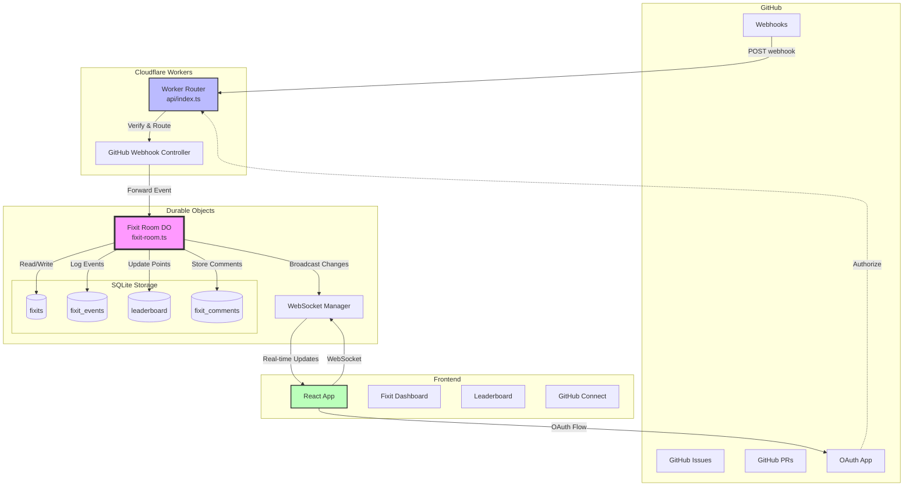
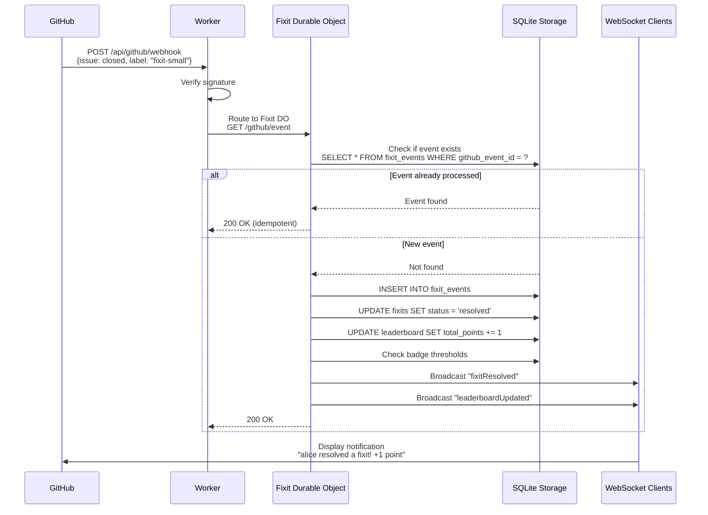
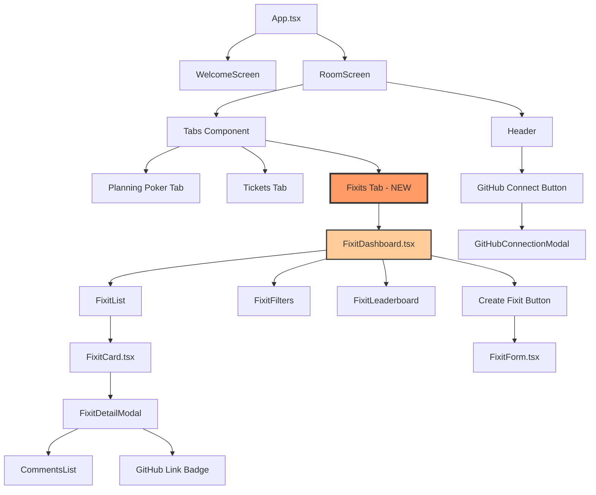
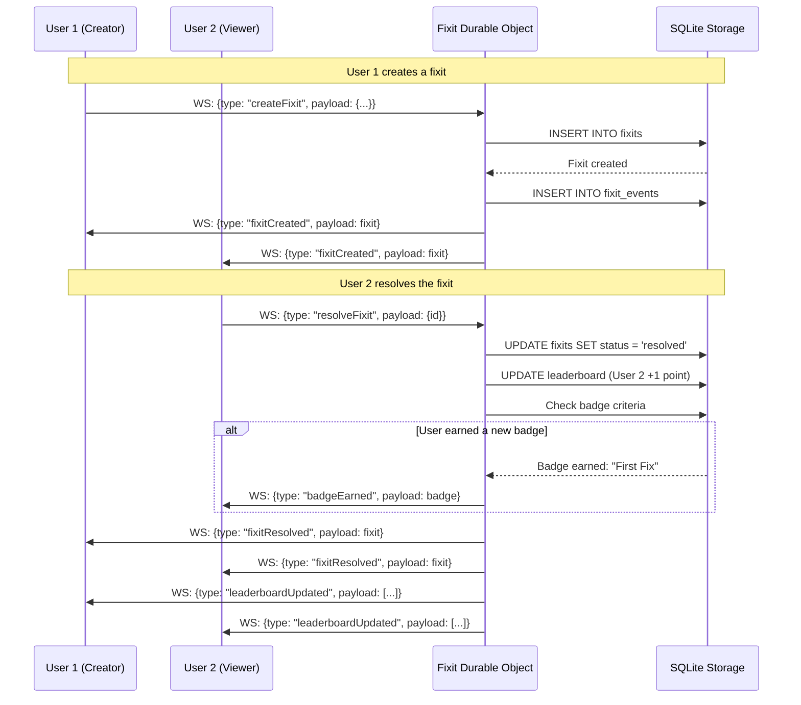
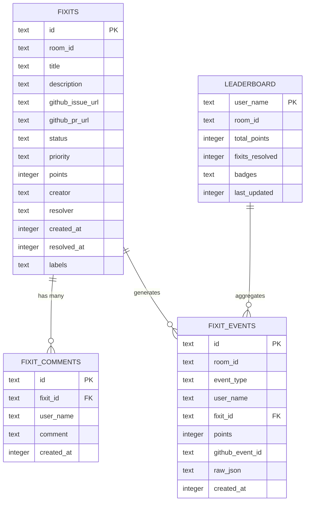
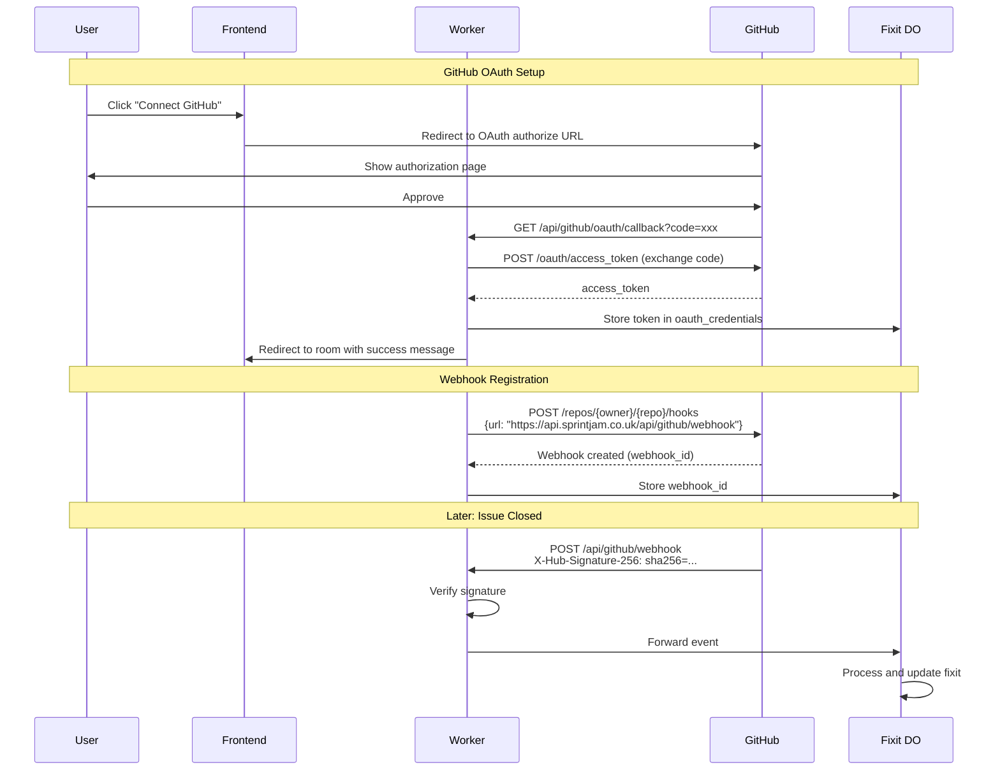

# Fixits Architecture Diagram

## System Architecture (Option A - Recommended)



## Data Flow: GitHub Issue Closed → Points Awarded



## Component Hierarchy



## WebSocket Message Flow



## Database Schema (SQLite in Durable Object)



## OAuth & Webhook Setup Flow



## Deployment Architecture

```
┌─────────────────────────────────────────────────────────────┐
│                     Cloudflare Edge                         │
│                                                             │
│  ┌────────────────┐         ┌─────────────────┐           │
│  │ Cloudflare     │         │  Cloudflare     │           │
│  │ Pages          │         │  Workers        │           │
│  │ (Frontend)     │◄────────┤  (API)          │           │
│  └────────────────┘         └────────┬────────┘           │
│                                      │                     │
│                             ┌────────▼────────┐           │
│                             │ Durable Objects │           │
│                             │  (FixitRoom)    │           │
│                             │                 │           │
│                             │  ┌───────────┐  │           │
│                             │  │  SQLite   │  │           │
│                             │  │  Storage  │  │           │
│                             │  └───────────┘  │           │
│                             └─────────────────┘           │
│                                                             │
└─────────────────────────────────────────────────────────────┘
                                │
                                │ Webhooks
                                ▼
                        ┌───────────────┐
                        │    GitHub     │
                        │   (Issues,    │
                        │     PRs)      │
                        └───────────────┘
```

## Technology Stack

| Layer | Technology | Purpose |
|-------|-----------|---------|
| **Frontend** | React 18 + TypeScript | UI components |
| **State Management** | React Context | Global state |
| **Routing** | React Router v6 | Client-side routing |
| **API Layer** | Cloudflare Workers | HTTP endpoints |
| **Real-time** | WebSockets | Live updates |
| **State Machine** | Durable Objects | Room state management |
| **Storage** | SQLite (DO) | Persistent data |
| **External API** | GitHub REST API v3 | Issue/PR integration |
| **Auth** | GitHub OAuth 2.0 | User authorization |
| **Deployment** | Cloudflare Pages + Workers | Hosting |

## Scaling Characteristics

### Durable Objects Scaling
- **Per-room isolation**: Each room gets its own Durable Object instance
- **Automatic scaling**: Cloudflare creates DO instances on-demand
- **No cold starts**: Durable Objects stay alive during active usage
- **Geographic distribution**: DOs automatically migrate closer to users

### Expected Load (per room)
- **WebSocket connections**: 5-20 concurrent users
- **Fixits per week**: 10-100
- **GitHub events per week**: 20-200
- **Leaderboard queries**: 50-500 per day

### Performance Targets
- **Fixit creation**: < 100ms
- **WebSocket broadcast**: < 50ms
- **GitHub webhook processing**: < 200ms
- **Leaderboard calculation**: < 100ms (cached in memory)

---

**Note**: This architecture is designed for **Option A (SQLite-only)**. For Option B (SQLite + D1), add D1 database nodes and event flow from Durable Object → D1 for historical storage.
